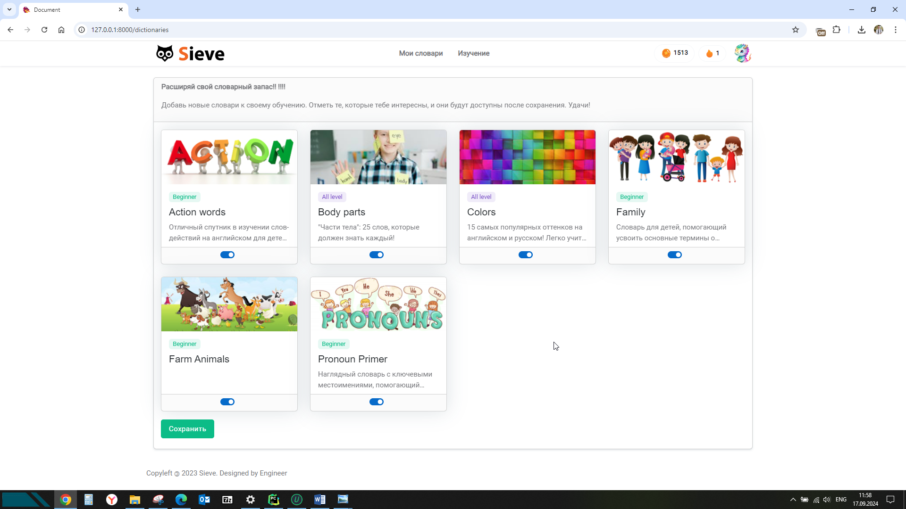
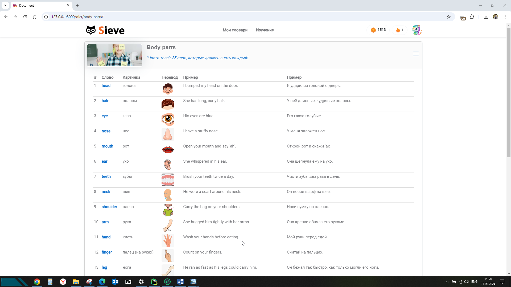
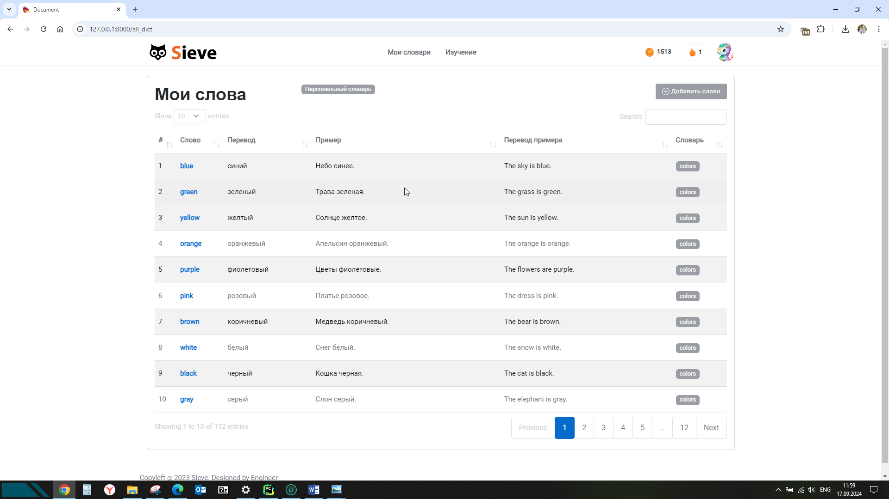
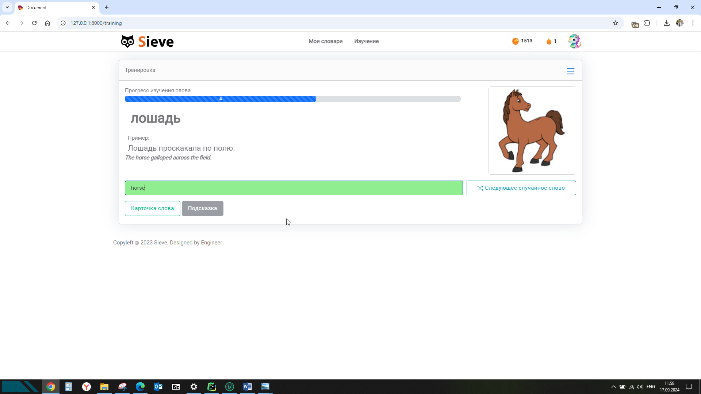
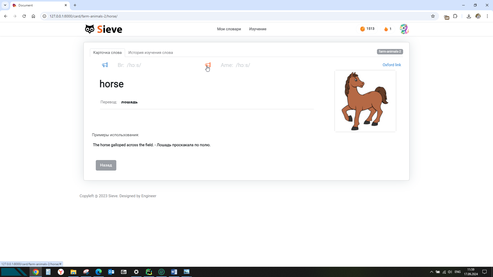
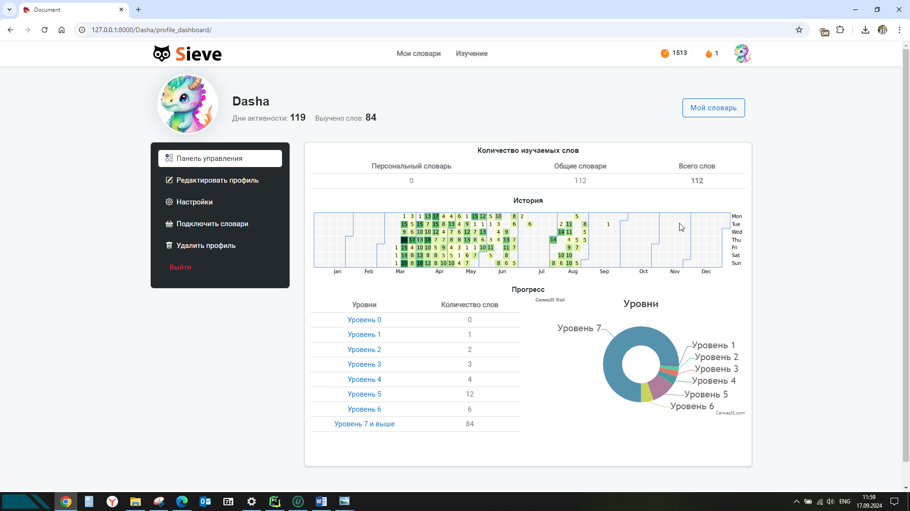

# Sieve

**Sieve** — это приложение для эффективного изучения новых слов. Оно позволяет пользователям использовать как личные, 
так и общие словари, предоставленные редакторами. Приложение помогает запомнить слова с помощью системы повторения, 
позволяя пользователям вводить слова и получать мгновенную обратную связь.

## Описание

Приложение **Sieve** предоставляет пользователям возможность изучать и закреплять новые слова. Система тренировки 
включает показ слов с их переводом, и пользователи должны вводить правильный перевод. После успешного ввода слово 
временно исчезает, что способствует лучшему запоминанию.  


## Скриншоты приложения

Ниже приведены несколько скриншотов, демонстрирующих ключевые разделы приложения.

### Главная страница


### Словари
Пользователь может как вести свой личный словарь, так и подключать словари по темам.

Общие словари созданы по темам. Можно выбрать именно то, что вам нужно.

В итоге пользователь формирует свой словарь из подключемых словарей и своего собственного персонального.


### Тренировка
Слова из подключенных словарей и персонального словаря становятся доступными в режиме тренировки слов.  
Нужно ввести перевод слова. Можно пользоваться подсказкой или, если слово не получилось вспомнить, посмотреть карточку слова.


### Карточка слова
Карточка слова содержит примеры использования, картинку и произношение.  
Если это слово из персонального словаря пользователя - произношение автоматически загрузится с oxfordlearnersdictionaries.com.


### Статистика
В изучении важно постоянство. Контроль статистики мотивирует занятия каждый день.  


### Награды
А если пользователь это ребенок - он будет очень рад получить приз за выученное слово.


### Как это работает

1. **Режим тренировки:**
   - Пользователь видит слово и его перевод.
   - Необходимо ввести правильный перевод слова.
   - В случае ошибки пользователь может просмотреть карточку слова для повторения.

2. **Уровни усвоения:**
   - Каждое слово имеет 7 уровней усвоения.
   - После каждого правильного ответа слово исчезает на несколько дней, в зависимости от количества правильных ответов.

3. **Цель:**
   - Слово считается выученным после 7 успешных вводов.
   - Минимальное время для полного усвоения слова — 22 дня.

## Установка

1. Клонируйте репозиторий:
   ```bash
   git clone https://github.com/yourusername/sieve.git
   cd sieve
   

   
2. Создайте и активируйте виртуальное окружение:
   ```bash
    python -m venv venv
    source venv/bin/activate  # Для Windows используйте `venv\Scripts\activate`

3. Установите зависимости:
   ```bash
   pip install -r requirements.txt

4. Примените миграции базы данных:
   ```bash
   python manage.py migrate
   
5. Запустите сервер разработки:
   ```bash
    python manage.py runserver
   
### Использование
Откройте веб-браузер и перейдите по адресу: http://127.0.0.1:8000  
Зарегистрируйтесь или войдите в систему.  
Начните тренировку слов, добавляйте свои словари и используйте общие словари.
### Вклад
Если вы хотите внести вклад в проект, пожалуйста, свяжитесь с автором через контактные данные ниже.

### Лицензия
Проект распространяется под Open Source License (OSL), что подразумевает полностью открытую лицензию, позволяющую свободное использование, изменение и распространение кода.

## Контактная информация

**Автор проекта:** Барыкин Евгений  
**Email:** barykin.evgeniy@gmail.com  
**GitHub:** [https://github.com/ebarykin](https://github.com/ebarykin)


